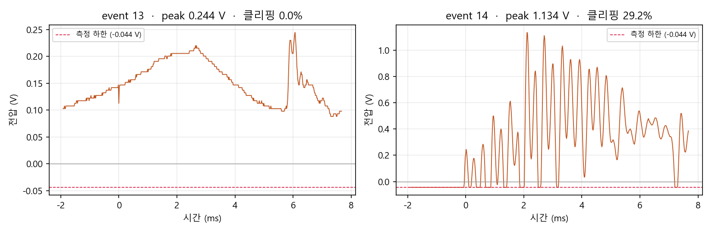
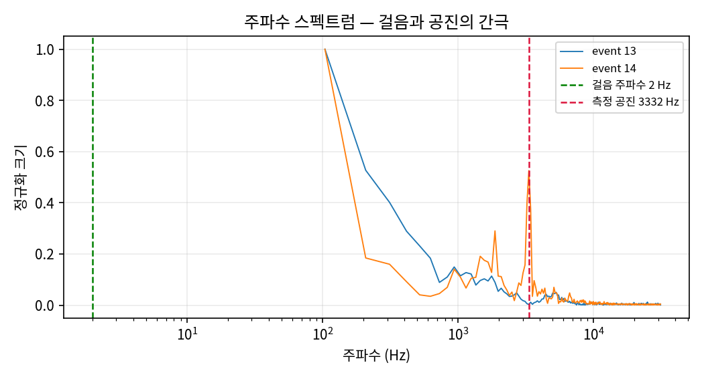
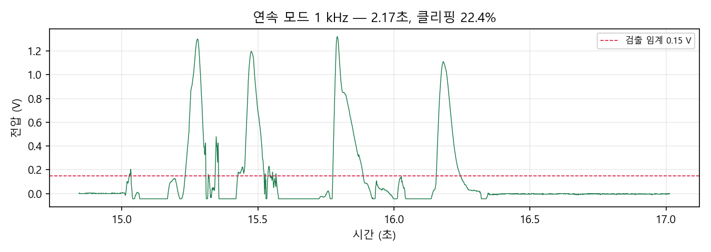
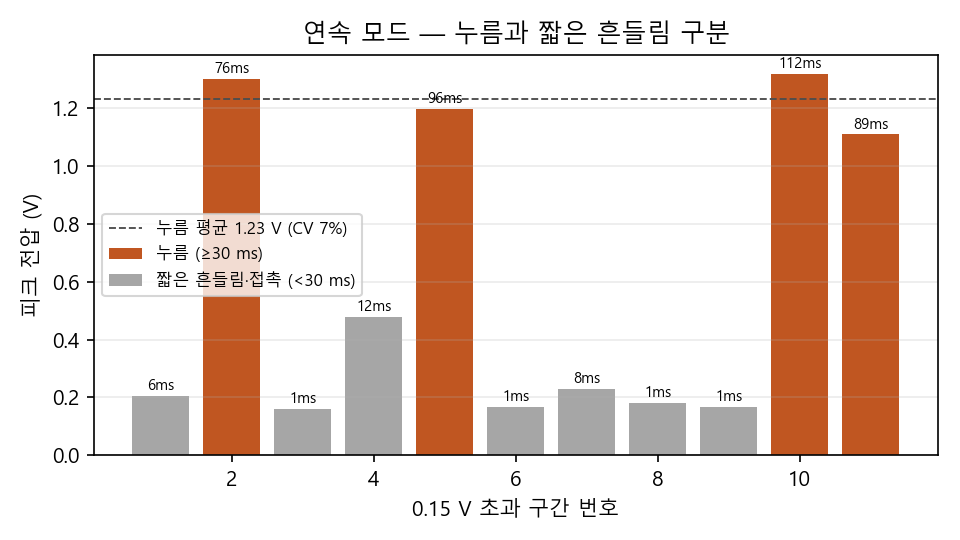

# piezo_hafs_108

**압전 타일을 밟으면 전기가 얼마나 나올까?**
압전 디스크의 첫 실측(4차시)과, 그 결과에서 출발한 압전 소재 설계(5차시) 기록

HAFS 유리프 압전 타일 연구 · 1학년 8반 · 측정 2026-09-11 / 소재 설계 2026-09-18

> **읽는 법** — 본문은 수치와 근거만 적는다. **▶ 처음 보는 사람을 위해** 상자를 펼치면
> 그 자리에 나온 개념을 고등학생 눈높이에서 설명한다. 이미 아는 내용이면 건너뛰면 된다.

---

## 한눈에 보기

- **측정** — 27 mm 압전 디스크를 세게 두드리면 최대 **1.13 V**가 나오고 약 **3.3 kHz**로 울린다 → [§2-1](#2-1-이벤트-요약), [§2-2](#2-2-공진-주파수--측정계-검증)
- **측정** — 손으로 누르면 폭 약 0.1초의 매끈한 펄스 하나(**1.1–1.3 V**)가 나온다. 공진보다 수백 배 느린 **준정적** 입력이다 → [§2-5](#2-5-재현성--손으로-누른-펄스)
- **한계** — 아두이노가 0 V 아래를 읽지 못해 파형의 음(−) 쪽이 잘렸고, 부하저항이 없어 전력은 아직 모른다 → [§3](#3-확인된-한계--다음-측정에서-고칠-것)
- **정정** — 다시 분석해 7개 항목을 바로잡았다 (4차시 철회 4 + 5차시 재분석 3) → [§2-6](#2-6-다시-분석해서-바로잡은-것)
- **설계** — 준정적 입력에서 소재를 고르는 기준은 d₃₃ 하나가 아니라 **d·g**다. εr를 낮추는 방향으로 조성을 설계했다 → [§7](#7-소재-설계--5차시-화학구조-제안)
- **제안** — **(Pb₀.₉₆Sm₀.₀₄)[(Zr₀.₅₂Ti₀.₄₈)₀.₈₈(Zn₁/₃Nb₂/₃)₀.₁₀Mn₀.₀₂]O₃**, [001] 배향 · 전하 합 0.00 · 허용인자 t = 0.984 → [§7](#7-소재-설계--5차시-화학구조-제안)
- **다음** — C_p 실측 → P–R 곡선 → 상용 소자 3종 d·g 비교 → [§4](#4-다음-차시-계획)

### 연구 흐름


### 저장소 구성

| 경로 | 내용 |
|---|---|
| [`piezo_capture_simple.ino`](piezo_capture_simple.ino) | 아두이노 측정 스케치 — 트리거 모드(62 kHz) / 연속 모드(1 kHz) |
| [`data/piezo_capture_data-1.csv`](data/piezo_capture_data-1.csv) | 측정 원자료 |
| [`analyze_v2.py`](analyze_v2.py) | 측정 분석 (현재판) — 요약 출력 + `figures/` 그림 4장 |
| [`analyze_v1.py`](analyze_v1.py) | 측정 분석 4차시판 — 철회한 계산이 들어 있어 기록용으로만 둔다 |
| [`docs/05_material_design.md`](docs/05_material_design.md) | 5차시 소재 설계 전문 — 용어 정의, 다섯 레버, 검증, 한계, 참고문헌 |
| [`docs/commercial_dg_table.csv`](docs/commercial_dg_table.csv) | 문헌 소재 11종 d·g 원자료 |
| [`calc/verify_composition.py`](calc/verify_composition.py) | 소재 설계의 모든 수치 재현 (표준 라이브러리만 사용) |
| [`structures/`](structures) | 결정구조 파일(CIF) — 기준 PZT와 제안 조성 |

---

## 1. 측정 개요

**왜 측정했나.** 학교 급식실·매점 바닥에 압전 타일을 깔면 발걸음으로 얼마나 전기를 얻을 수 있는지가 연구 질문이다.
30 × 30 cm 타일 기준 전면 포설은 급식실 581장(52.3 m² ÷ 0.09 m²) / 매점 220장이다.
동선이 집중되는 구역만 **10 % 포설**한다고 보면 각각 58장 / 22장이 된다.
그때까지의 계산은 전부 문헌값 기반 추정이었고, 이번이 **첫 실측**이다.

| 항목 | 내용 |
|---|---|
| 소자 | PZT 압전 디스크 27 mm, 황동판 위 세라믹 (Piezo Shock Tap Sensor 모듈에서 원판만 분리) |
| 측정 장비 | Arduino Uno, ADC 레지스터 직접 제어 |
| 회로 | 압전소자 (+) → A0, (−) → GND **(부하저항·분압기 없음, 직결)** |
| 트리거 모드 | 62,469 Hz (샘플 간격 16.0 µs, 스케치가 부팅 시 자가 측정) · 기준선에서 ADC 30칸(0.147 V) 넘게 흔들리면 앞 120 + 뒤 480 = 600샘플(9.6 ms) 저장 |
| 연속 모드 | 1,000 Hz로 계속 기록 · 2.17초(2,171샘플) |
| 기준선 | ADC 9 (= 0.044 V) |
| 수집량 | 트리거 이벤트 2건(event 13, 14) + 연속 모드 2.17초 |

```
 압전 디스크 (+) ────────── A0   ┐
                                 │ Arduino Uno
 압전 디스크 (−) ────────── GND  ┘
 (8번 핀 → 220 Ω → LED → GND : 트리거 표시등, §3 (3) 참조)
```

<details>
<summary><b>▶ 처음 보는 사람을 위해</b> — 압전 효과, 유니모프 벤더, 개방전압, ADC, 샘플링</summary>

- **압전 효과** — PZT 같은 결정은 양이온과 음이온의 무게중심이 애초에 조금 어긋나 있다. 누르면 그 어긋남이 변하고, 변한 만큼 표면에 전하가 생겨 전압이 된다.
- **유니모프 벤더** — 우리 디스크는 황동판 한 면에 얇은 세라믹을 붙인 구조다. 밟으면 판 전체가 휘고, 세라믹은 두께 방향이 아니라 **면 방향으로** 늘거나 준다. 이 차이가 §2-4와 §7에서 중요해진다.
- **개방전압** — 아무 부하 없이 양 끝 전압만 잰 값. 전류가 흐르지 않으니 이것만으로는 전력(= 쓸 수 있는 에너지)을 알 수 없다.
- **ADC** — 0–5 V를 0–1023 정수로 바꾸는 장치. 한 칸이 약 4.9 mV이고, **0 V 아래는 모두 0으로** 읽힌다.
- **샘플링 주파수** — 1초에 몇 번 읽는가. 62,469 Hz면 16 µs마다 한 번이다. 3.3 kHz 진동 한 주기(0.3 ms)에 약 19번 찍히므로 모양을 충분히 그릴 수 있다. 1 kHz 연속 모드로는 이 진동을 그릴 수 없지만, 0.1초짜리 누름 펄스는 100번 찍혀 충분하다.

</details>

측정 코드: [`piezo_capture_simple.ino`](piezo_capture_simple.ino) · 분석 코드: [`analyze_v2.py`](analyze_v2.py) · 원자료: [`data/piezo_capture_data-1.csv`](data/piezo_capture_data-1.csv)

---

## 2. 핵심 결과

### 2-1. 이벤트 요약

| event | 피크 전압 | 최저 전압 | 하한 클리핑 | 최대 dV/dt | 공진 주파수 | 비고 |
|---|---|---|---|---|---|---|
| 13 | 0.244 V | +0.088 V | 0.0 % | 1,831 V/s | — | 약한 준정적 가압, 공진 미검출 |
| 14 | **1.134 V** | −0.044 V | **29.2 %** | 17,106 V/s | **3,332 Hz** | 제대로 된 타격 |

4차시 판에 있던 감쇠 시정수 τ·기계적 Q 열은 뺐다 — 이유는 §2-2.

event 13은 약하게 눌린 경우다. 파형이 울림 없이 천천히 오르내리고(그림 1 왼쪽), 스펙트럼에도 봉우리가 없다(그림 2 파랑).
4차시 판의 `521 Hz`는 분석 코드가 500 Hz 미만을 잘라낸 뒤 남은 **첫 FFT 칸**이 뽑힌 값이었다 — 공진이 아니다.

<details>
<summary><b>▶ 처음 보는 사람을 위해</b> — 하한 클리핑, dV/dt</summary>

- **하한 클리핑** — ADC가 0 아래를 못 읽어 바닥에 붙은 샘플의 비율. event 14는 600개 중 175개(29.2 %)가 바닥에 붙었다. 실제 파형은 그 아래로 더 내려갔다는 뜻이다(§3 (1)).
- **dV/dt** — 전압이 1초에 몇 V씩 변하는가. 압전소자에 흐르는 전류는 `i = C_p · dV/dt`이므로, 전류를 가늠하는 데 쓴다(§2-4).

</details>

### 2-2. 공진 주파수 — 측정계 검증


*그림 1. 트리거 파형. 왼쪽 event 13(약한 가압), 오른쪽 event 14(타격). 빨간 점선이 ADC가 읽을 수 있는 하한이다.*


*그림 2. FFT 스펙트럼. event 14(주황)만 3.33 kHz에 봉우리가 있다. 회색 구간은 측정창 길이 때문에 생기는 성분이라 분석에서 뺐다.*

event 14는 트리거 직후부터 약 0.3 ms 간격으로 봉우리가 되풀이된다 — 디스크가 제 고유진동수로 울리고 있다.
주파수를 서로 독립인 두 방법으로 쟀다.

| 방법 | 결과 | 정밀도 |
|---|---|---|
| FFT 최대 봉우리 | **3,332 Hz** | FFT 칸 간격 104 Hz (= 1 ÷ 측정창 9.6 ms) |
| 파형 봉우리 24개의 간격 중앙값 0.304 ms | **3,287 Hz** | 샘플 간격 16 µs |

두 값은 FFT 칸 하나 안에서 일치한다.

대표적인 27 mm 황동판 압전 디스크(Murata 7BB-27-4)의 데이터시트 공진 주파수는 **4.6 ± 0.5 kHz**다.
측정값은 이보다 약 1 kHz 낮다. 데이터시트 값은 정해진 지지 조건에서 잰 것이고, 우리 디스크는 바닥에 놓고 손으로 쳤으며 모델명도 알 수 없다.
따라서 이 비교로 말할 수 있는 것은 여기까지다 — **측정계가 이 크기 디스크의 기계적 진동(kHz 대)을 실제로 잡아내고 있다.**

**감쇠 시정수 τ와 기계적 Q는 이 데이터로 정하지 않는다.** 4차시 판은 τ = 0.655 ms, Q ≈ 6.9를 적었지만 성립하지 않는다.

1. 가장 큰 봉우리(1.134 V)는 트리거 후 2.1 ms에야 나오고, 2.1–4.8 ms 동안 봉우리 10개가 0.81–1.13 V로 거의 줄지 않는다. 한 번 친 뒤 지수적으로 줄어드는 감쇠 진동 모양이 아니다.
2. 4차시 판의 피팅 구간은 최대점 뒤 0.38 ms — 진동 약 한 주기였다. 포락선의 감쇠가 아니라 봉우리에서 골로 내려가는 진동 한 번을 잰 셈이다.
3. 음(−) 반주기가 잘려 있어(§3 (1)) 진동 성분의 진폭을 따로 떼어 낼 수 없다.

2.5 V 바이어스로 음 반주기를 살린 뒤(§4의 2번) 다시 잰다.

<details>
<summary><b>▶ 처음 보는 사람을 위해</b> — 공진, FFT, 칸 간격, Q</summary>

- **공진(고유진동수)** — 종을 치면 치는 방식과 상관없이 늘 같은 음높이로 울린다. 물체마다 가장 잘 흔들리는 주파수가 정해져 있고, 이 디스크는 약 3.3 kHz다.
- **FFT** — 복잡한 파형을 "어떤 주파수가 얼마나 섞여 있나"로 분해하는 계산. 봉우리가 있는 곳이 그 신호의 주된 주파수다.
- **칸 간격(주파수 분해능)** — 9.6 ms 동안만 기록한 신호로는 1 ÷ 9.6 ms ≈ 104 Hz보다 촘촘하게 주파수를 구분할 수 없다. 그래서 FFT 결과는 104 Hz 간격의 칸으로 나온다.
- **Q (품질계수)** — 한 번 친 뒤 몇 주기나 울리다 멎는가. 진폭이 1/e로 줄어드는 시간을 τ라 하면 `Q = π · f · τ`. 이 식은 진폭이 지수적으로 줄어들 때만 쓸 수 있는데, event 14는 그 모양이 아니었다.

</details>

### 2-3. 최적 부하저항

최적 부하는 다음 차시 P–R 실측으로 결정한다.

4차시 판의 R_opt 계산표(3.2 kΩ / 5.3 MΩ)는 삭제했다.
`R_opt = 1/(2πfC)`는 소자를 사인파로 계속 흔들 때의 식인데, 발걸음은 한 번 눌렀다 떼는 펄스이고 C_p도 아직 가정값이다.
저항을 바꿔 가며 전력을 직접 재는 편이 확실하다(§3 (2)).

### 2-4. 유도 물리량

부하저항 없이 측정했으므로 전력을 직접 잴 수 없다. 대신 정전용량 C_p를 가정하면 나머지를 유도할 수 있다. (event 14, V_peak = 1.134 V, dV/dt = 17,106 V/s)

| C_p | 전하 Q | 저장 에너지 E | 변위전류 i |
|---|---|---|---|
| 10 nF | 11.3 nC | 6.4 nJ | 171 µA |
| 15 nF | 17.0 nC | 9.6 nJ | 257 µA |
| 20 nF | 22.7 nC | 12.9 nJ | 342 µA |
| 30 nF | 34.0 nC | 19.3 nJ | 513 µA |

사용한 식:
- 전하 `Q = C_p · V`
- 저장 에너지 `E = ½ C_p V²`
- 변위전류 `i = C_p · dV/dt`

> ※ **추정 힘 F 열을 뺀 이유** — 이 디스크는 황동판에 세라믹을 붙인 유니모프 벤더로 굽힘 모드(d₃₁ + 기계적 증폭)로
> 동작하므로 d₃₃ = 400 pC/N 대입이 부적절하다. 또한 측정한 V는 타격 후 울림의 피크이지
> 가한 힘에 대응하는 정적 전하가 아니므로, 링잉 진폭에서 힘을 역산하는 것은
> 원리적으로 성립하지 않는다. 자세한 내용은 [`docs/05_material_design.md`](docs/05_material_design.md) §0 참조.

**C_p가 이 표 전체를 좌우한다. 다음 차시 최우선 과제는 C_p 실측이다.**
참고로 같은 크기 디스크의 데이터시트 정전용량은 20 nF ± 30 %(Murata 7BB-27-4)로 표의 가정 범위 안에 있지만, 우리 디스크의 값은 직접 재야 한다.

크기를 가늠하면 — LED 하나(약 2 V, 2 mA)를 1 ms 켜는 데 4 µJ가 든다. 한 번 두드려 소자에 쌓인 에너지(약 10 nJ)의 **약 400배**다.
음 반주기가 잘려 표의 값은 과소평가다(§3 (1)). 그래도 그 몫만으로 이 간극을 메우려면 잘린 음(−) 쪽 전압이 양(+) 쪽의 약 20배(√400)여야 한다.

### 2-5. 재현성 — 손으로 누른 펄스


*그림 3. 연속 모드(1 kHz) 2.17초. 폭 약 0.1초의 큰 펄스 4개와 그 뒤의 짧은 흔들림이 보인다.*


*그림 4. 0.15 V를 넘은 구간 11개. 주황 = 30 ms 이상 이어진 누름, 회색 = 짧은 흔들림·접촉. 막대 위 숫자는 0.15 V를 넘은 시간.*

연속 모드 2.17초 동안 0.15 V를 넘은 구간은 11개였다. 그림 3에서 보듯 성격이 둘로 갈린다.

| 구분 | 개수 | 0.15 V 초과 폭 | 피크 전압 |
|---|---|---|---|
| **누름** | 4 | 76–112 ms | 1.109 / 1.198 / 1.300 / 1.320 V |
| 짧은 흔들림·접촉 | 7 | 1–12 ms | 0.161–0.479 V |

짧은 7개 중 6개는 누름이 끝나고 45 ms 안에 나왔다(손을 떼는 순간의 흔들림으로 보인다). 나머지 1개는 첫 누름 전의 약한 접촉이다.

| 지표 (누름 4회) | 값 |
|---|---|
| 평균 피크 전압 | 1.232 V |
| 표준편차 | 0.084 V |
| **변동계수 CV** | **6.9 %** |

4차시 판은 11개 구간을 모두 "타격"으로 세어 CV 75.1 %, "세기가 8배까지 벌어졌다"고 적었다. 게다가 봉우리를 찾는 80 ms 창이 겹쳐 같은 봉우리를 두 번 센 경우도 있었다(4차시 그림의 3·4번, 6·7번 막대).
**그 산포는 손 세기의 차이가 아니라 셈법의 문제였다.**

그래도 4회는 통계로 부족하고, 손으로 누르면 힘이 몇 N인지 모른다.
**힘을 알고 고정하는 장치**(일정 높이 낙하추 등)는 여전히 필요하다 — §7의 상용 소자 비교도 "같은 힘"이 전제다.

이 펄스는 §7의 출발점이기도 하다. 손으로 누른 입력은 **폭 0.1초의 매끈한 펄스**로 기록됐다 — 공진 주기(0.3 ms)보다 수백 배 느린 준정적 입력이다. 발걸음도 이런 입력이다.

<details>
<summary><b>▶ 처음 보는 사람을 위해</b> — 변동계수 CV</summary>

- **CV = 표준편차 ÷ 평균.** 값들이 평균에서 얼마나 퍼져 있는지를 %로 나타낸다. 평균이 다른 두 실험의 흩어짐을 비교할 때 쓴다. 6.9 %면 네 번의 누름이 평균 1.23 V에서 대략 ±0.08 V 안에 모였다는 뜻이다.
- 무엇을 "한 번"으로 셀지 먼저 정하지 않으면 같은 데이터에서도 CV가 7 %도, 75 %도 나온다. 이번 정정의 핵심이 이것이다.

</details>

### 2-6. 다시 분석해서 바로잡은 것

4차시 연구일지에서 철회한 4개와, 5차시에 원자료를 다시 분석하며 찾은 3개다. 4차시 판 원문은 커밋 기록과 [`analyze_v1.py`](analyze_v1.py)에 그대로 남아 있다.

| # | 항목 | 4차시 판 | 지금 | 이유 | 시점 |
|--:|---|---|---|---|---|
| 1 | event 13 공진 · τ · Q | 521 Hz / 2.07 ms / 3.4 | — (공진 미검출) | 500 Hz 하한 위 첫 FFT 칸이 뽑힌 값, 파형에 울림 없음 (§2-1) | 4차시 일지 |
| 2 | "걸음과 공진이 1,666배 차이" | 절 제목 + 비율 표 | 삭제 | 걸음 2 Hz는 측정값이 아니고(이 측정의 FFT는 104 Hz 아래를 보지 못한다), 두 주파수의 비가 출력 손실 배율을 뜻하지도 않는다. "발걸음은 공진보다 훨씬 느린 준정적 입력"이라는 결론만 §7로 이어진다 | 4차시 일지 |
| 3 | R_opt 계산표 | 3.2 kΩ / 5.3 MΩ | P–R 실측으로 결정 | 사인파 가정의 식 + 가정한 C_p (§2-3) | 4차시 일지 |
| 4 | 추정 힘 F (d₃₃ = 400 pC/N) | 28–85 N | 삭제 | 굽힘(d₃₁) 모드 소자, 링잉 피크는 정적 전하가 아님 (§2-4) | 4차시 일지 |
| 5 | event 14 τ · Q | 0.655 ms / 6.9 | 정하지 않음 | 피팅이 약 한 주기뿐, 지수 감쇠 모양이 아님, 음 반주기 잘림 (§2-2) | 5차시 재분석 |
| 6 | "문헌상 공진 3~4 kHz" | 측정값이 범위 안 | 데이터시트 4.6 ± 0.5 kHz보다 약 1 kHz 낮음 | 출처 확인 결과 (§2-2) | 5차시 재분석 |
| 7 | 재현성 | 11회, CV 75.1 % | 누름 4회, CV 6.9 % | 짧은 흔들림을 타격으로 셈 + 봉우리 이중 계수 (§2-5) | 5차시 재분석 |

---

## 3. 확인된 한계 — 다음 측정에서 고칠 것

### (1) 음(−) 반주기가 잘려나갔다

가장 큰 문제다. 아두이노 ADC는 0 V 미만을 읽지 못한다.
기준선이 ADC 9(= 0.044 V)에 불과해서, 음전압 여유가 사실상 없다.

event 14에서 **600샘플 중 175개(29.2 %)가 0에 붙어 평평**하고, 연속 모드에서도 22.4 %가 그렇다.
그림 1 오른쪽에서 아래쪽이 잘린 모양으로 바로 보인다.

압전소자는 누를 때 (+), 뗄 때 (−)로 움직이므로 **실제 발생 에너지의
절반 가까이가 기록되지 않았다.** 지금 표의 에너지 값은 전부 과소평가다.

→ **해결**: 5 V를 저항 두 개로 나눠 A0에 2.5 V 기준점을 만들면 양쪽 반주기를 모두 읽을 수 있다.
단, 이 두 저항은 압전소자에 **병렬 부하**로 걸린다. 1 MΩ 두 개면 500 kΩ이고, C_p ≈ 20 nF라면 시정수 RC ≈ 10 ms다.
폭 0.1초의 누름 펄스는 이보다 훨씬 길어서 제 높이까지 오르지 못한다. 저항을 키워 RC를 펄스 폭보다 충분히 길게 하거나, OP앰프 버퍼를 앞에 두는 방법을 함께 검토한다.

### (2) 부하저항이 없어 전력·효율을 측정하지 못했다

직결 측정이라 이번에 얻은 건 **개방전압(open-circuit voltage)** 이다.
전력 P = V²/R을 구하려면 정해진 부하가 필요하다.

→ **해결**: 10 kΩ ~ 10 MΩ 범위에서 저항을 바꿔가며 P–R 곡선을 그린다.
최적 부하는 이 스윕에서 실측으로 정한다.

### (3) ⚠️ LED 점등은 발전의 증거가 아니다

측정 중 220 Ω LED가 켜지는 것을 확인했으나, **이 LED는 아두이노 8번 핀이
켠 것**이다. 스케치의 해당 부분:

```cpp
if (d >= TRIG_DELTA) {
    fired = true;
    digitalWrite(LED_PIN, HIGH);   // 두드리는 순간 LED 켜짐
}
```

즉 LED는 **USB 전원**으로 켜진 트리거 표시등이며, 압전소자가 만든 전기로
켜진 것이 아니다. 보고서에 "압전소자로 LED를 점등했다"고 쓰면 사실과 다르다.

→ **압전 발전으로 LED를 켜려면** 아두이노와 완전히 분리해서
`압전소자 → 브리지 정류기 → 커패시터 → LED` 회로를 따로 꾸며야 한다.
이건 다음 차시에 별도 실험으로 해볼 가치가 있다.

### (4) 표본이 적다

트리거 이벤트 2건, 연속 모드의 누름 4회로는 통계를 내기에 부족하다. 저항 조건당 최소 10회를 목표로 한다.

---

## 4. 다음 차시 계획

1. **C_p 측정** — LCR 미터, 없으면 알고 있는 저항과의 RC 시정수로 역산
2. **2.5 V 바이어스 추가** — 음 반주기 복원 (한계 (1) 해결). 분압 저항이 부하로 걸리는 효과도 함께 확인
3. **P–R 곡선** — 10 kΩ~10 MΩ 스윕, 조건당 10회
4. **낙하추 지그** — 가한 힘을 알고 고정한다. 같은 힘을 줘야 소자·부하 비교가 성립한다
5. **독립 LED 회로** — 정류 + 커패시터로 진짜 압전 발전 점등 시도
6. **상용 소자 3종 d·g 비교** — C_p 측정과 같은 세션에서 수행.
   §7의 소재 설계 근거를 우리 데이터로 검증한다.

---

## 5. 재현 방법

```bash
pip install pandas numpy matplotlib
python analyze_v2.py                 # 측정 분석 → 요약 출력 + figures/ 그림 4장
python calc/verify_composition.py    # 소재 설계 수치 검증 (추가 설치 없음)
```

`analyze_v2.py`는 `data/`의 CSV를 읽어 `figures/`에 그래프 4장을 만들고 요약을 출력한다.
주요 출력: event 14 공진 3,332 Hz(봉우리 간격 3,287 Hz), 연속 모드 누름 4회 평균 1.232 V · CV 6.9 %.

[`analyze_v1.py`](analyze_v1.py)는 4차시판이다. 철회한 계산(추정 힘, R_opt, τ·Q)이 들어 있어 기록용으로만 둔다. 실행하면 `figures/`를 4차시 그림으로 덮어쓴다.

### 측정 다시 하기

1. 회로를 §1대로 연결하고 [`piezo_capture_simple.ino`](piezo_capture_simple.ino)를 Arduino Uno에 올린다.
2. 시리얼 모니터를 **500000 baud**로 연다. 부팅하면 샘플 간격과 기준선을 스스로 재서 `#` 줄로 출력한다.
3. 기본은 트리거 모드다. 시리얼로 `c`를 보내면 연속 모드와 번갈아 바뀌고, `r`은 기준선 재측정, `s`는 설정 출력이다.
4. 출력을 CSV로 저장해 `data/`에 넣는다.

### CSV 열 설명

| 열 | 뜻 |
|---|---|
| `event` | 트리거 번호 (0 = 연속모드) |
| `n` | 샘플 번호. 트리거 시점이 0, 음수는 직전 구간 |
| `t_us` | 트리거 기준 시간 (µs) |
| `adc_raw` | ADC 원시값 (0~1023) |
| `v_piezo` | 변환 전압 (V) = (adc_raw − 기준선) × 5 / 1023 |

`#` 로 시작하는 줄은 측정 설정과 이벤트 요약 메모다.

---

## 6. AI 활용 기록

| 활용 목적 | AI가 제안한 내용 | 직접 검토·수정한 내용 |
|---|---|---|
| 아두이노 측정 코드 작성 | ADC 레지스터 직접 제어, 원형 버퍼 트리거 구조 | 컴파일 오류(함수 선언 순서) 확인·수정. 분압기 없는 직결 회로에 맞게 전압 변환식과 출력 열을 단순화 |
| 분석 코드 작성 | FFT 공진 검출, 지수 감쇠 피팅 | FFT 저주파 피크(104 Hz)가 측정창 길이(9.59 ms)에서 생긴 허상임을 확인하고 500 Hz 미만 제외 |
| 결과 해석 | 공진-걸음 주파수 불일치 해석 | 27 mm 디스크 문헌 공진값(3~4 kHz)과 측정값 3,332 Hz 대조 확인 |
| 회로 검토 | LED 점등의 전원 출처 지적 | 스케치에서 `digitalWrite(LED_PIN, HIGH)` 확인 → 발전 증거가 아님을 확정 |
| 소재 조성 설계 | d·g 기준(Priya 2010), MPB 단사정(Noheda 1999), Sm–Mn 자기보상, TGG 조직화 | 전하 중성을 직접 계산해 `x_Sm = (4−v_Mn)·x_Mn` 일반식 유도. NASA 물성표가 OCR 오류로 내부 모순이 있음을 확인하고 단일 출처(US 7,686,974)로 표를 재구성 |
| 주장의 정량 검증 | 순위상관 계산 아이디어 | 문헌 11종의 Spearman ρ(d33, g33) = −0.955를 직접 계산. 레버 04(산소 공공 활용)와 검증 1(공공 제거)이 상충한다는 것을 발견해 문서에 명시 |
| 저장소 정리 · 재분석 (Claude Code) | README를 두 독자용으로 재구성, 그림 경로 복구, `analyze_v2.py` 작성, 파형·스펙트럼·연속 모드 재검토, 데이터시트·특허 원문 대조 | 정정 7건과 근거를 §2-6 표로 공개하고, 모두 `analyze_v2.py`·`verify_composition.py`로 다시 계산할 수 있게 함. 위 "결과 해석" 행의 문헌 공진값은 §2-6의 6번으로 정정 |

---

## 7. 소재 설계 — 5차시 화학구조 제안

측정으로 확인한 두 가지가 소재 선택 기준을 바꿨다.

1. 이 디스크는 **유니모프 벤더**이므로 굽힘(d₃₁) 모드로 동작한다 → 문헌 d₃₃을 그대로 대입할 수 없다
2. 발걸음(1–3 Hz)은 실측 공진(3,332 Hz)에서 크게 벗어난 **준정적 영역**이다 → 공진 증폭을 쓸 수 없다. 손으로 누른 입력도 폭 0.1초의 펄스로 기록됐다(§2-5)

공진을 쓸 수 없으면 "한 번 눌렀을 때 뽑아낼 수 있는 에너지"가 전부이고,
그 값을 지배하는 것은 d₃₃ 단독이 아니라 곱 **d·g = d²/(ε₀εr)** 다 (Priya 2010).

```
U = ½ (d · g) σ² V        U: 한 번 누를 때 저장되는 에너지 [J]
                          σ: 응력 [N/m²],  V: 소재 부피 [m³]
```

<details>
<summary><b>▶ 처음 보는 사람을 위해</b> — d, g, εr, 그리고 왜 d·g인가</summary>

- **d (압전 전하 상수, pC/N)** — 1 N으로 눌렀을 때 생기는 전하. 첨자 `33`은 "분극축(3) 방향으로 눌러 분극축 방향으로 전하를 뽑는다", `31`은 "분극축에 수직(1) 방향으로 늘이고 줄여서 분극축 방향으로 뽑는다"는 뜻이다. 우리 디스크는 휘면서 세라믹이 면 방향으로 늘고 주므로 31이다.
- **εr (비유전율)** — 소재가 전하를 얼마나 잘 "품고" 있는가. 같은 전하라도 εr가 크면 전압이 낮게 나온다.
- **g (압전 전압 상수)** — 같은 응력에서 생기는 전압(전계). `g = d / (ε₀ εr)`.
- **왜 곱인가** — 전기 에너지는 ½ × 전하 × 전압이다. 전하는 d에, 전압은 g에 비례하므로 에너지는 d·g에 비례한다. d가 커도 εr가 더 크게 따라 오르면 g가 떨어져서 에너지는 오히려 줄 수 있다.

</details>

### d와 g는 맞교환한다

US 7,686,974 FIG. 13의 **문헌 소재 11종**(상용 10종 + 발명자의 UTA 연구 조성 1종)으로 확인했다. 대표 세 줄만 옮긴다 — 전체는 [`docs/commercial_dg_table.csv`](docs/commercial_dg_table.csv).

| 소재 | 종류 | d₃₃ (pC/N) | g₃₃ (10⁻³ m²/C) | d·g (10⁻¹⁵ m²/N) | d₃₃ 순위 | d·g 순위 |
|---|---|--:|--:|--:|--:|--:|
| EDO EC-98 | 상용 | 730 | 15.6 | 11,388 | 1 | 5 |
| Morgan PZT-507 | 상용 | 700 | 20.0 | 14,000 | 2 | 2 |
| UTA PZT–PZN + Mn | 연구 조성 | 291 | 55.6 | 16,168 | 9 | **1** |

```
                          11종 전체     상용 10종만 (UTA 제외)
Spearman ρ (d33, g33)      -0.955        -0.976     <- 거의 완벽한 역상관
Spearman ρ (d33, d·g)      +0.518        +0.830
Pearson    r (d33, d·g)    +0.399        +0.814
```

- **d가 큰 소재일수록 g는 거의 예외 없이 작다** — 맞교환은 어느 묶음에서나 강하다.
- 상용 10종끼리는 d₃₃ 순위가 d·g 순위를 **대체로 따라간다**(ρ = +0.83). 그래도 d₃₃ 1위(730 pC/N)가 d·g로는 상용품 중 4위다.
- 11종의 상관이 +0.518로 떨어지는 것은 거의 **UTA 한 점** 때문이다 — d₃₃은 291 pC/N로 9위인데 d·g는 1위다.

그러므로 이 표가 보여 주는 것은 "d₃₃으로 d·g를 전혀 예측할 수 없다"가 아니라,
**d₃₃을 키우는 길 말고 εr를 낮추는 길로도 d·g 1위에 오를 수 있다**는 것이다. 아래 조성은 그 두 번째 길을 따른다.

<details>
<summary><b>▶ 처음 보는 사람을 위해</b> — 순위상관 ρ</summary>

- **Spearman ρ** — 두 목록을 각각 1등, 2등, … 순위로 바꾼 뒤 그 순위가 얼마나 같은 순서로 움직이는지를 −1 ~ +1로 나타낸다. +1이면 순위가 완전히 같고, −1이면 정반대, 0이면 관계가 없다.
- 점 하나가 결과를 크게 흔들 수 있다. 그래서 UTA를 넣은 경우와 뺀 경우를 **둘 다** 적었다.

</details>

### 제안 조성

> **(Pb₀.₉₆Sm₀.₀₄)[(Zr₀.₅₂Ti₀.₄₈)₀.₈₈(Zn₁/₃Nb₂/₃)₀.₁₀Mn₀.₀₂]O₃**, [001] 배향 조직화

- 전하 중성이 **정확히 0.00** — Sm³⁺ 잉여(+0.04)와 Mn²⁺ 결손(−0.04)이 상쇄되어 공공이 생기지 않는다
- Goldschmidt 허용인자 **t = 0.9843** — 페로브스카이트 안정 구간 유지 (기준 PZT 52/48은 0.9897)
- 예상 d·g **2 ~ 4 × 10⁴ × 10⁻¹⁵ m²/N** — 두 실측 시스템 사이의 **내삽**이지 측정값이 아니다

다섯 레버가 각각 문헌 근거를 가진다. 목표는 하나 — **d를 지키면서 εr를 낮춘다.**

| 레버 | 무엇을 | 왜 | 근거 |
|---|---|---|---|
| 01 기반 | Zr : Ti = 52 : 48 (MPB) 유지 | 상경계에서 분극 방향이 연속으로 회전해 압전 응답이 최대 | Noheda 1999 |
| 02 B자리 | Zr/Ti의 10 %를 Zn₁/₃Nb₂/₃로 치환 | 릴랙서 성분으로 εr를 크게 낮춤 → g 확보 (근거 조성: d₃₃는 고성능 PZT의 절반, εr는 약 1/6) | Islam & Priya 2006 |
| 03 A자리 | Pb의 4 %를 Sm³⁺로 치환 | 국소 구조 불균질성으로 d 상승. ε가 폭증하기 전까지만 | Li 2018, Yan 2016 |
| 04 B자리 | Mn²⁺ 2 % | 결함 쌍극자로 도메인벽 고정 → εr·손실 억제, 반복 하중 내구성, Sm 전하 보상 | Yue 2025 |
| 05 미세구조 | [001] 배향 조직화 (TGG) | 이 방향에서 d가 최대이면서 εr가 최소 | Yan 2013 |

설계 안의 상충 하나도 숨기지 않았다 — 레버 04는 산소 공공과 짝지은 결함 쌍극자를 쓰는데, 전하 중성은 공공을 없앤다.
완전 보상 지점을 기준선으로 두고 최적 보상비는 실험 변수로 남겼다(`docs/05` §4).

<details>
<summary><b>▶ 처음 보는 사람을 위해</b> — 조성식 읽는 법, 페로브스카이트, 전하 중성, 허용인자</summary>

- **페로브스카이트 ABO₃** — 정육면체 꼭짓점에 큰 양이온 A, 중심에 작은 양이온 B, 면 중심에 산소가 있는 구조. PZT는 A = Pb, B = Zr 또는 Ti다. B가 산소 팔면체 한가운데에서 살짝 비켜나 있는 것이 압전성의 근원이다.
- **조성식 읽기** — 소괄호 ( )가 A자리, 대괄호 [ ]가 B자리다. A자리는 Pb 96 % + Sm 4 %, B자리는 (Zr 52 : Ti 48) 88 % + (Zn 1/3 · Nb 2/3) 10 % + Mn 2 %. 아래 첨자는 그 자리를 차지하는 비율이다.
- **전하 중성** — 결정 전체의 (+)와 (−)가 같아야 한다. Pb²⁺ 자리에 Sm³⁺가 들어가면 +1이 남고, Ti⁴⁺ 자리에 Mn²⁺가 들어가면 −2가 모자란다. Sm 0.04 × (+1) = +0.04, Mn 0.02 × (−2) = −0.04로 정확히 상쇄되도록 비율을 맞췄다. 일반식 `x_Sm = (4 − v_Mn) · x_Mn`.
- **허용인자 t** — A와 B 이온의 크기가 맞아야 페로브스카이트 틀이 유지된다. `t = (rA + rO) / [√2 · (rB + rO)]`, 0.9 < t < 1이면 안정. 필요조건일 뿐이라 실제로 만들었을 때 다른 상이 섞이는지는 X선 회절로 확인해야 한다.
- **결정 구조 수치** — 기준 PZT(Noheda 2000 실측)에서 B 양이온은 산소 평면보다 0.299 Å 위에 있고, 위아래 B–O 결합이 1.848 Å / 2.292 Å로 0.444 Å 차이 난다. 이 비대칭이 쌓인 것이 자발분극이다.

</details>

### 파일

| 파일 | 내용 |
|---|---|
| [`docs/05_material_design.md`](docs/05_material_design.md) | 설계 근거 전문 — 용어 정의, 다섯 레버, 검증, 한계 |
| [`docs/commercial_dg_table.csv`](docs/commercial_dg_table.csv) | 문헌 소재 11종 d·g 비교 원자료 |
| [`calc/verify_composition.py`](calc/verify_composition.py) | 전하 중성 · 허용인자 · 결합 기하 · 순위상관 재현 스크립트 |
| [`structures/PZT_52_48_P4mm.cif`](structures/PZT_52_48_P4mm.cif) | 기준 구조 (Noheda 2000 Rietveld 실측 좌표) |
| [`structures/HAFS108_proposed_P4mm.cif`](structures/HAFS108_proposed_P4mm.cif) | 제안 조성 (점유율만 변경 — 측정된 구조가 아니다) |

CIF 파일은 [VESTA](https://jp-minerals.org/vesta/) 등 결정구조 뷰어에서 바로 열린다.

    python calc/verify_composition.py

### 이 제안을 어떻게 검증할 것인가

조성 자체는 1,230 °C 소결과 TGG 공정이 필요해 학교에서 만들 수 없다.
그러나 **조성 설계의 근거가 된 명제**는 지금 가진 소자로 검증할 수 있다.

상용 소자 3종(경질 PZT-4 계열 / 5A / 5H 계열)에서 같은 힘·같은 부하로
개방전압과 C_p를 측정해 g를 역산하고, 데이터시트 d와 곱해 d·g 순위를 만든다.
d₃₃ 순위와 d·g 순위가 따라가는지 어긋나는지를 실측하면, 어느 결과가 나오든
이 절의 출발점이 문헌 인용이 아니라 우리 데이터가 된다.
문헌상 상용품끼리는 대체로 따라가므로(ρ = +0.83) "어긋난다"를 미리 결론으로 두지 않는다.

C_p 측정은 이미 다음 차시 최우선 과제이므로 추가 장비가 필요 없다.

---

## 참고 자료

- Murata, 7BB-27-4 압전 진동판 제품 정보 (27 mm, 공진 4.6 ± 0.5 kHz, 정전용량 20 nF ± 30 %) — [murata.com](https://www.murata.com/en-us/products/productdetail?partno=7BB-27-4)
- R. A. Islam, S. Priya, US Patent 7,686,974 B2, "High energy density piezoelectric ceramic materials," FIG. 13 — [Google Patents](https://patents.google.com/patent/US7686974B2/en)
- S. Priya, "Criterion for material selection in design of bulk piezoelectric energy harvesters," *IEEE TUFFC* **57**, 2610 (2010)
- B. Noheda *et al.*, *Phys. Rev. B* **61**, 8687 (2000) — CIF 원자 좌표의 출처
- Y. Yan *et al.*, *Appl. Phys. Lett.* **102**, 042903 (2013) — [001] 조직화 PMN–PZT, d·g = 59,000 × 10⁻¹⁵ m²/N

소재 설계의 나머지 문헌(12편)은 [`docs/05_material_design.md`](docs/05_material_design.md) §7에 있다.
